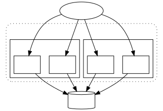

## 防重复提交与接口幂等性
在互联网应用中我们通常要求接口具有幂等性,即同一个数据接口调用多次系统效果一致.在幂等性接口中,重复提交的问题应该是不存在的.在增删改时为保证幂等性,我们在执行数据操作时必须要检测数据库存量数据状态,从而避免重复操作或者异常操作.但在并发场景下,由于数据库隔离策略,当另外一个请求没有提交的情况下,当前线程查询数据无法发现充分提交的数据,导致幂等性失效.这时就需要分布式锁限制并发.



## 为什么需要分布式锁 
对数据资源的增删改查时,如果存在并发操作将导致数据一致性发生异常,集中式单体服务通常使用数据库锁实现对并发的控制.

## 使用分布式锁的场景
1. 防止重复提交,比如创建支付订单.
2. 对多资源做原子性操作时实现集中控制.比如对商品库存数量的更新操作.

## 数据库悲观锁
通常我们可以通过数据库select ... for upate实现悲观锁.如果我们可以直接对资源主键加锁那么用数据库的悲观锁是最方便的.
如果使用非主键查询for upate会导致大量性能问题(比如锁住索引).在插入数据的场景下select for update库也无法优雅的实现分布式锁.

## 分布式锁理论
同数据库锁一样,分布式锁的基本假设是通过将对目标资源的原子操作串行化从而实现对并发问题的规避.
锁通常包含加锁,解锁的过程.在分布式场景中,由于网络稳定性和系统稳定性等原因,无法保证加锁和解锁对称操作的完整性.为了避免加锁后由于异常原因导致锁无法释放的场景,需要增加超时自动释放的机制避免死锁.

所以,分布式锁需要关注以下几点:
- 互斥资源的唯一标识
- 锁独占默认释放时间

redis由于以下特性非常适合作为分布式锁的实现
- redis是一个单线程服务的应用,先天具有将所以请求串行执行响应的能力
-  redis在处理单个请求时可以保证执行操作的原子性
- 具有超时自动清理数据的机制

## redis的方案
redis的setnx(set if not exist)是一个原子操作,当锁存在不能设置值，返回0；锁不存在，则设置锁，返回1； 
其加锁伪代码如下
```java
1. var i = jedis.setnx(key, value);
2. if(i==1) {
3.          jedis.set(key, expire));
4.         //do something;
5.         jedis.del(lock);
     }
```
以上代码的问题在于如果第1步到第3步间系统停止了,锁将永远无法释放,导致死锁.

我们可以通过jedis.call()执行脚本,由于redis可以保证单个命令的串行执行,所以可以保证执行的完整性.

```shell
local lockClientId = redis.call('GET', KEYS[1])
if lockClientId == ARGV[1] then
  redis.call('PEXPIRE', KEYS[1], ARGV[2])
  return true
elseif not lockClientId then
  redis.call('SET', KEYS[1], ARGV[1], 'PX', ARGV[2])
  return true
end
return false
```

Spring Integration提高了分布式锁的全局抽象,并redis是其实现之一.为了方便开发,我基于Spring Integration实现了@DistributedLock注解.


## 配置Redis数据源
```yaml
spring:
  redis:
    host: 127.0.0.1
    port: 6379
```
## 启用拦截器
在工程中使用@EnableDistributedLock启用拦截器

## 在方法上声明分布式锁

```java
  @DistributedLock(prefix = "order")
 public Order create(@LockKey("userId") Order order) {
     //do something
 }

```


## @DistributedLock配置详解
@DistributedLock通过prefix, delimiter, key组合生成互斥资源的唯一标识, 通过expire, timeUnit约定默认释放时间.

1. prefix <br>
prefix配置的是redis key的前缀,它通常应该是一个需要加锁的主题或场景,不同的主题应该使用不同的前缀,从而避免潜在的冲突.

2. key <br>
是主题或者资源的唯一标识,如果是修改或者删除一个资源, 那么这个资源的主键自然就适合作为key值.但在新增资源的场景下,这个资源主键还未生成,通常情况下我们应该以资源的外键作为新增资源的key值.<br/>

key接受spel表达式.取值的上下文是被注解的接口的参数args数组.比如对于方法method(Class<?> a, Class<?> b); 表达式"#root[0].name+#root[1].name"将取两个参数的名词拼接到一起.

@LockKey是@DistributedLock.key()的快捷方案.获取被注解参数的属性值,当没有赋值时,直接调用被注解方法的toString()方法